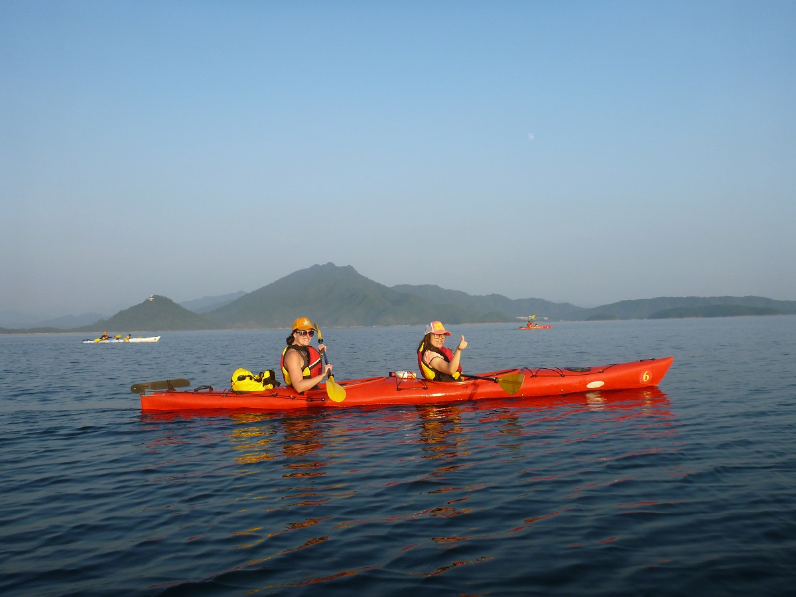
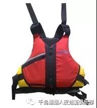
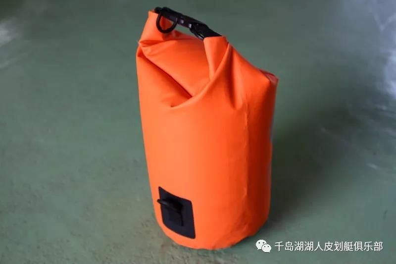

### 我们提供

本俱乐部为学员提供以下划艇装备：双人座舱式海洋舟、单人座舱式海洋舟、船桨、救生衣、儿童桨、儿童救生衣、防水袋 、划艇帽 、防浪裙、海绵、抽水泵、助浮袋、救援绳、地图、头灯、夜光服等。

建议个人自带装备：太阳镜，防晒霜，长袖防晒服，快干裤（沙滩裤），水，干粮，至少一套换洗衣物。

### 装备介绍

##### 1、双人座舱式海洋独木舟：

- 材质：LLDPE
- 工艺：滚塑
- 尺寸：517x68x45.5（cm）
- 重量：40KG 安全载重：210KG

##### 2、单人座舱式海洋独木舟：

-     材质：LLDPE

-     工艺：滚塑

-     尺寸：508x55x38（cm）

-     重量：33KG 安全载重：147KG

##### 3、救生衣：

- 浮力材质：前片PVC，后背EPE

- 浮力：80N;面料210D涤纶布，符合人体曲线的立体造型，穿着更舒适，腰部和肩部安装调节扣，适合各种体型的人穿着。 穿在身上在水里有很好的浮态，仰躺时能使头部浮在高位。配备有哨子，腰部有防滑垫。

- 标准：符合欧洲标准验定

##### 4、船桨：

-     材质：桨杆玻纤、桨叶PE

- 尺寸：220cm/215cm/210cm/180cm

-     重量：0.9KG 

-     角度30°-60°

##### 5、防水包：

功能：储放换洗衣服、干粮、相机、手机、手表等贵重物品

特点：国际工业防水IPX7级，耐磨，耐用性强，携带方便

-          尺寸：30x76（cm）

-          容量：15L

-          材质：聚醚TPU复合面料     

更多装备参考：

