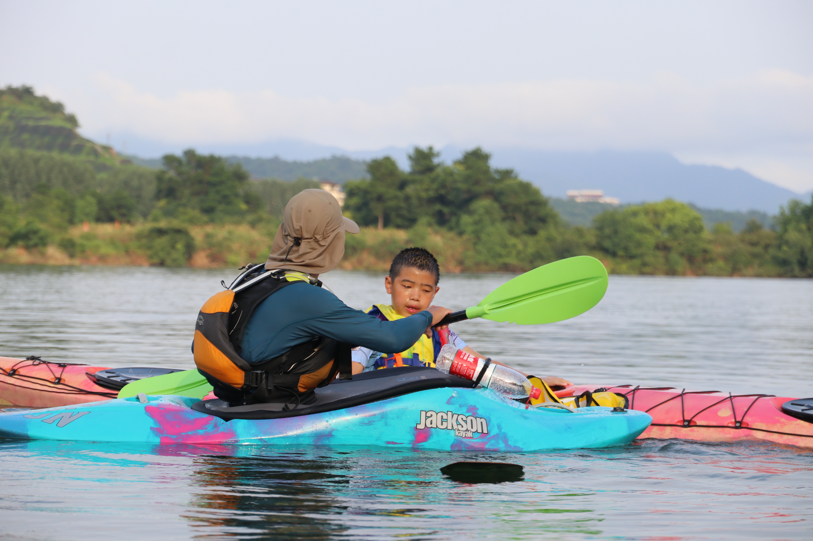
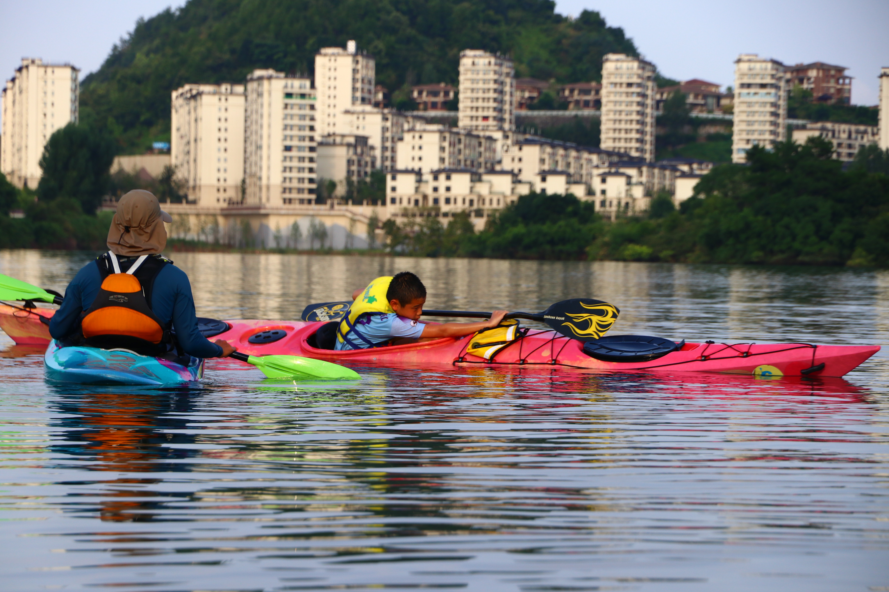

2020年7月23-28日

来自北京的杨爸爸和妈妈专程带孩子到千岛湖湖人皮划艇俱乐部学习美国（ACA）独木舟协会认证二级技能课程培训+爱斯基摩翻滚技能。10岁的倍倍，两天时间通过二级技能考核，两天时间学会爱斯基摩翻滚，是俱乐部目前学会爱斯基摩翻滚年龄最小的。祝贺倍倍！同时也要感谢家长的支持！

以下是倍倍学习皮划艇技能课程的照片和视频。

倍倍在俱乐部接待室

教练在水上指导倍倍

倍倍在学习爱斯基摩翻滚准备动作

阿栋教练在码头教导倍倍划桨动作要点

倍倍与阿栋、欧文教练的合影

10岁的倍倍成功完成爱斯基摩翻滚，令人印象深刻！

<video width="90%" id="video" controls="" preload="none" poster="https://lakerskayak.club/images/boy3.jpg">
      <source id="mp4" src="https://lakerskayak.club/images/boy_roll.mp4" type="video/mp4">
</video>