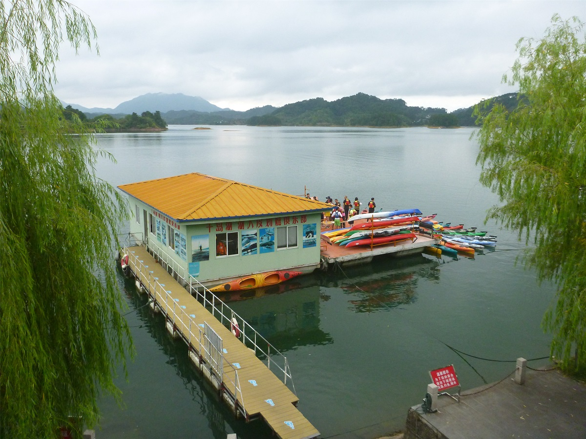
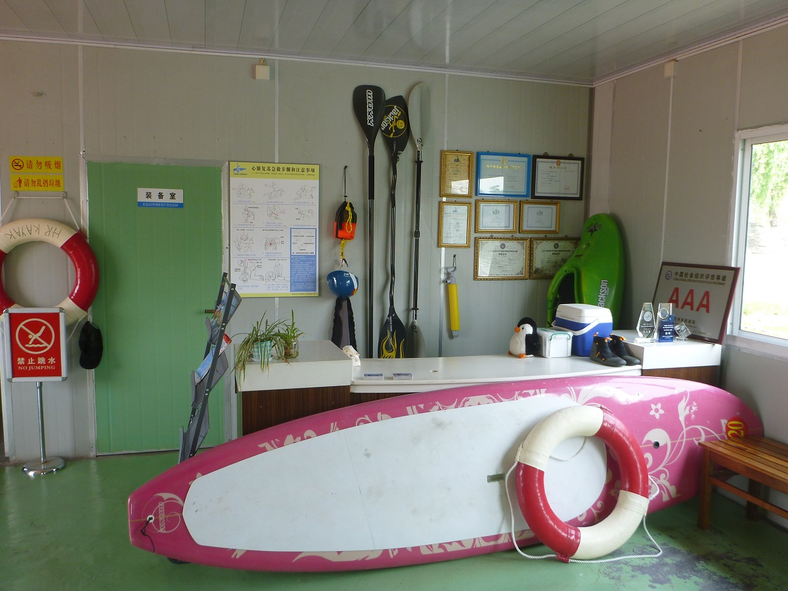
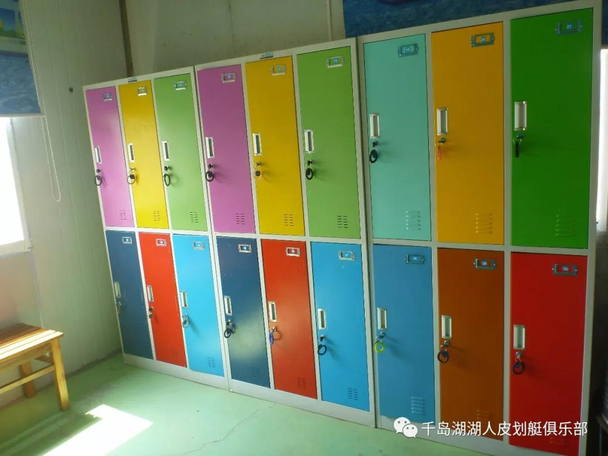
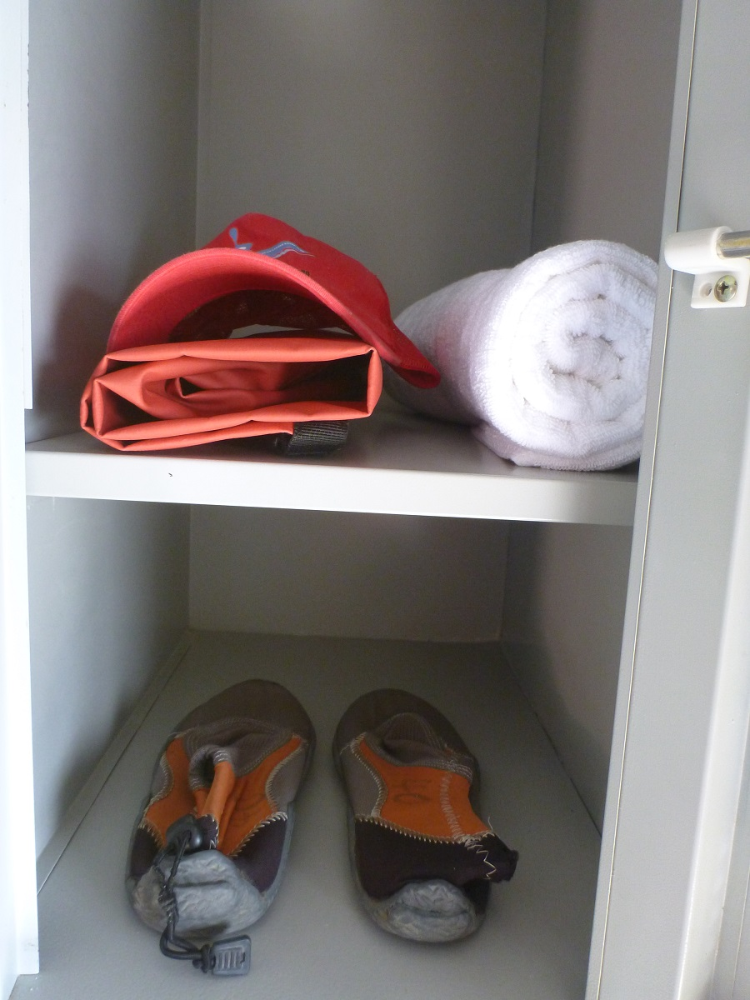
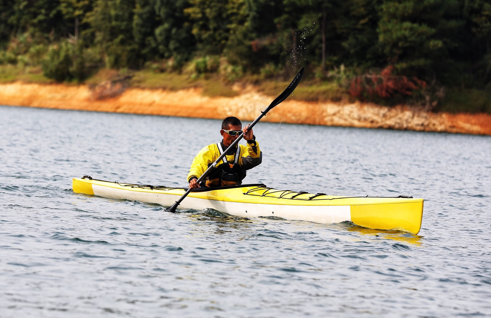
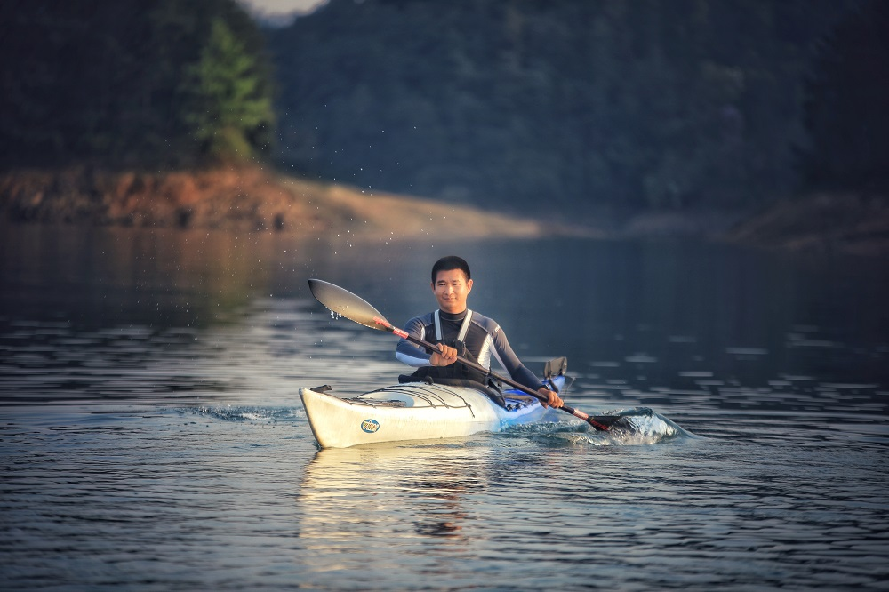
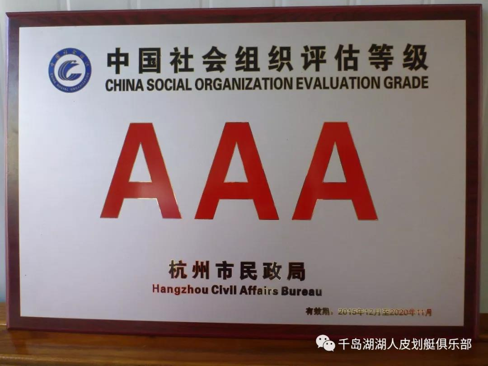
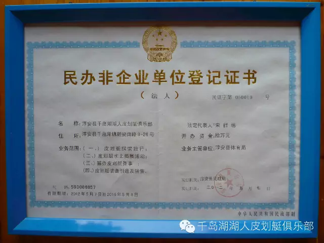
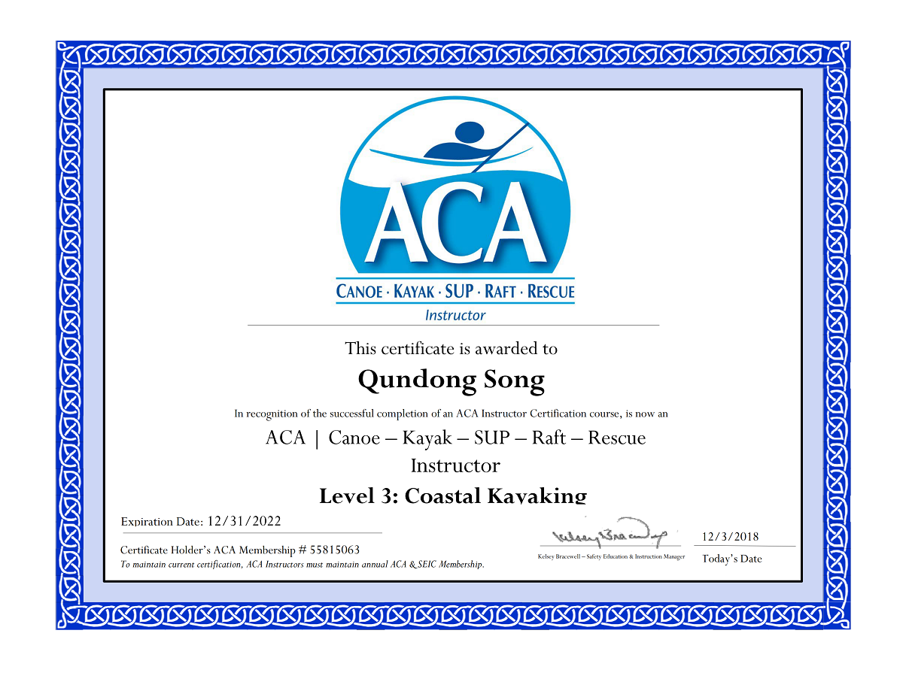
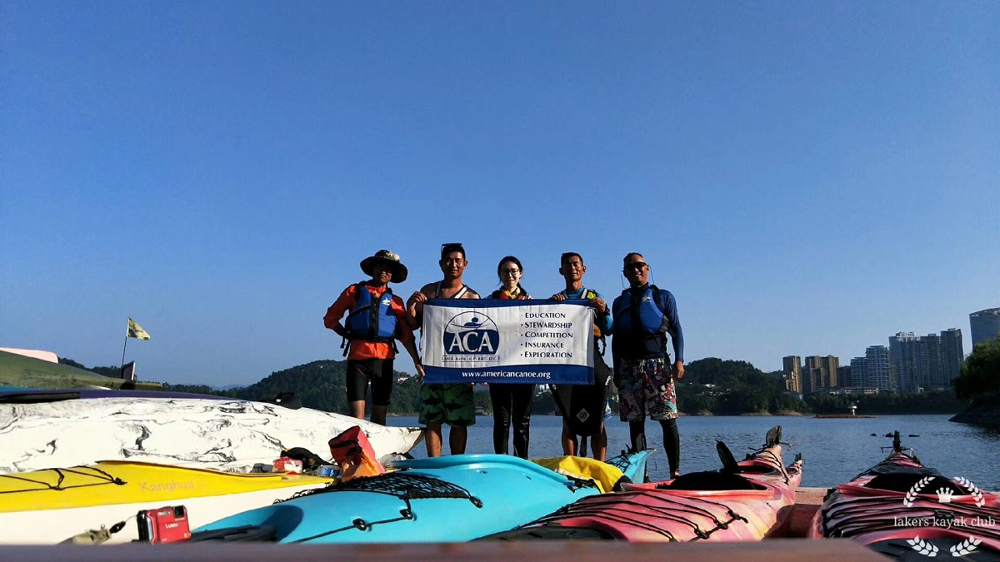

### 简介

千岛湖湖人皮划艇俱乐部成立于2012年5月，设施完善、拥有独立的培训场地，采用美式化教学，由美国ACA认证皮划艇教练为您专业指导，是一家专业做水上皮划艇探索旅行的俱乐部。其主要宗旨：教育、培训、环保、组织、探索。千岛湖风景如画，是最适合进行水上活动的地方，皮划艇是细细探索千岛湖数千公里美丽湖岸和岛屿及港湾的最佳方式。

### 场地设施

俱乐部基地设在千岛湖镇东南湖区（千岛湖镇滨湖路96号 ），我们有幸拥有世界上最为得天独厚的皮划艇资源。基地设有接待室、男更衣室、女更衣室、休息室、装备室、码头。

接待室

更衣室

更衣室里，给每个学员准备了太阳帽、防水袋、浴巾和划艇鞋。

装备室

俱乐部拥有皮划艇50余艘，sup立式浆板，花式艇，我们为学员提供以下划艇装备：双人座舱式海洋舟、单人座舱式海洋舟、船桨、救生衣、儿童桨、儿童救生衣、防水袋 、划艇帽 、防浪裙、海绵、抽水泵、助浮袋、救援绳、地图、头灯、夜光服等。

更详细的皮划艇装备介绍，请看→[俱乐部划艇装备展示](http://lakerskayak.club/20190614-equipment/)。

### 俱乐部活动项目

俱乐部活动主要分成三个部分：皮划艇短途旅行、皮划艇长途旅行、ACA培训课程。我们接受个人预约，也接受团队报名。无论是青少年培训、公司团建，还是家庭活动、个人体验，这里都推荐了最具独特的活动，让您的千岛湖皮划艇之旅充满意义。

活动咨询、预约热线：15158019159 - 阿栋，13588360785 - 小方。

更详细的活动项目介绍，请看→[湖人皮划艇俱乐部活动项目](http://lakerskayak.club/course/)。

### 教练介绍

##### 千岛湖人 - 阿栋（宋群栋）

美国ACA认证皮划艇探索旅行教练

美国ACA认证皮划艇三级教练

水上救生员

社会体育（游泳）教练

社会体育指导员（二级）

从事皮划艇运动12年

##### 千岛湖人 - 欧文（方樟勇）

美国ACA认证皮划艇探索旅行教练

美国ACA认证皮划艇三级教练

水上救生员

社会体育指导员（二级）

从事皮划艇运动11年

### 俱乐部证书

### 千岛湖人团队合影

> 从左到右：小余、欧文、静宁、阿栋、劲松。

静宁（jenny42）毕业于中国科学技术大学，应用物理系（14203），千岛湖人志愿者，负责本网站开发、设计、内容维护。
