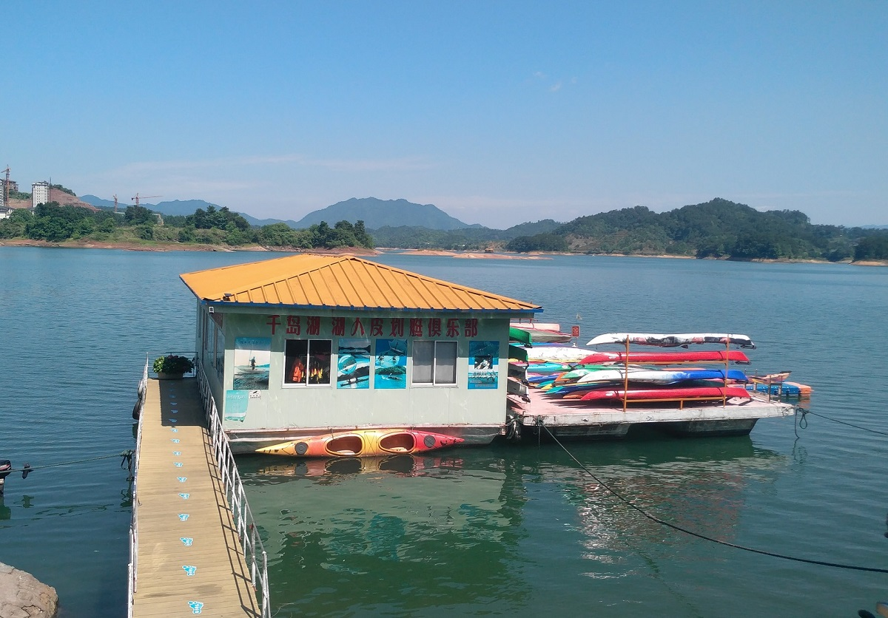
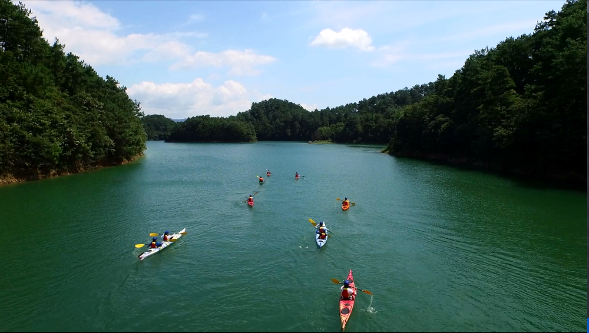
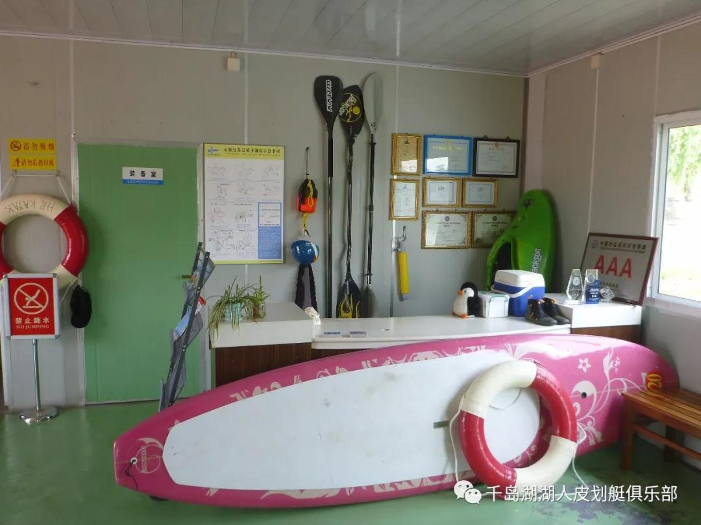
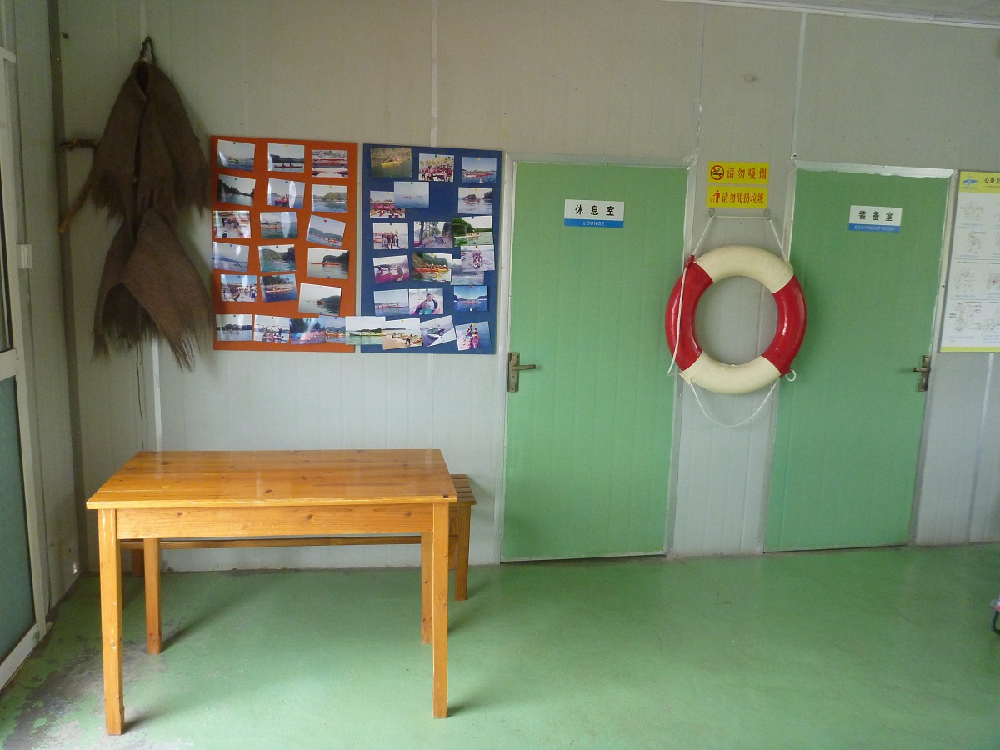
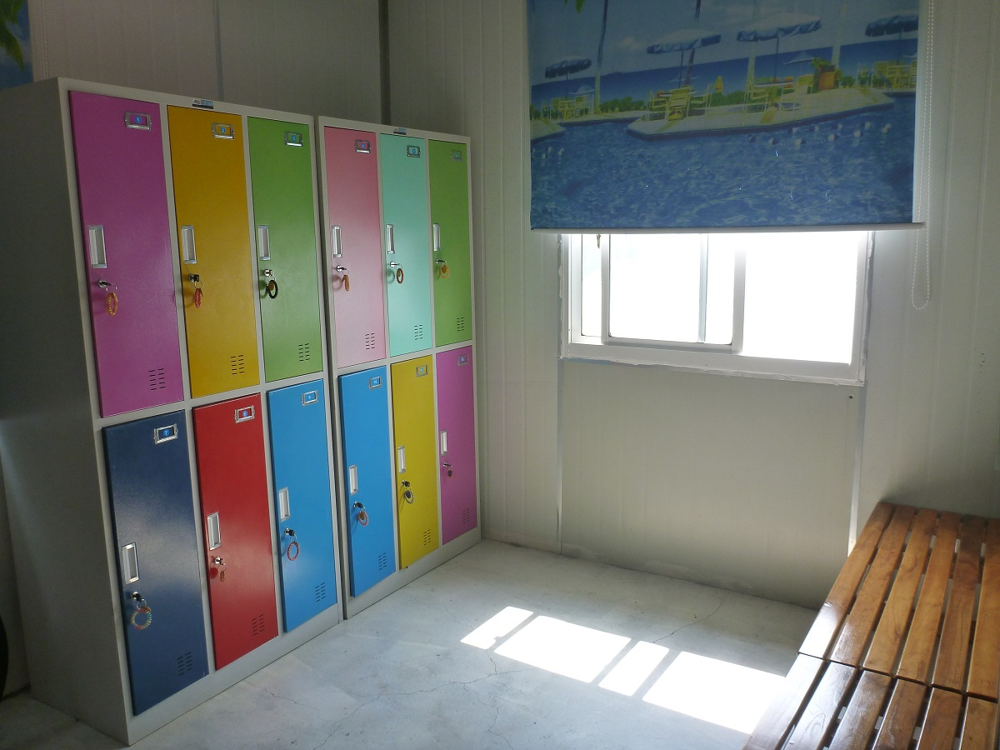
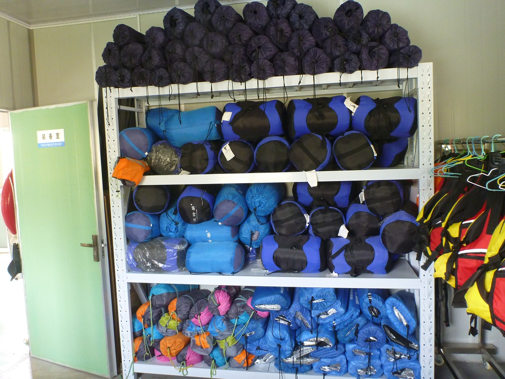

### Introduction

Qiandao Lake Lakers Kayak Club was found in May 2012. Qiandao Lake (also known as 'Thousand Island Lake') is a human-made, freshwater lake located in Chun'an County, Zhejiang Province. It is a wonderful place for a variety of outdoor activities. Kayaking is the best way to explore the beautiful shores, islands, and harbors of Qiandao Lake for thousands of miles.

Lakers Kayak Club offers a wide variety of trips and lessons for both kayaking and stand up paddle boarding. Our instructors are trained and certified by the American Canoe Association (ACA). No other shop in Qiandao Lake can offer the breadth of experience, knowledge, and ability that we do! 

### Kayak Trips and ACA Lessons

We offer many types of kayaking trips and ACA lessons.  For short-distance kayaking trips, we provide 2-hour trip, half-day trip and night kayaking trip (2 hours). For long-distance kayaking trips, we provide 1-day trip, 2-day camping trip and 3-day camping trip. For ACA lessons, there are also many choices, including half-day training, ACA Level 1, Level 2, Level 3 sea kayaking skills training and kayak roll training. We accept individual registration as well as group registrations. Please contact us for more information and the price.

### Our Facilities

Lakers Kayak Club has more than 50 kayaks, including single and tandem sit-in-side sea kayaks, stand up paddle boards (SUP) and white water kayaks. We can provide our  customer with kayak, paddle (adults and kids'), life jacket (adults' and kids'), waterproof bag, kayak hat, spray skirt, sponge, bilge pump, paddle float, rescue throw bag, map, headlamp and reflective clothes for night kayaking. (For more information, check [here](https://lakerskayak.club/20190614-equipment/)). We have a reception room, men's changing room, women's changing room, a lounge, an equipment room, and a dock.

Reception room

Changing room

Equipment room

### Our Instructors

##### Adong (Qundong Song)

Adong has been kayaking for 12 years. He is an American Canoe Association (ACA) certified Level 3: Coastal Kayaking Instructor. He is also a lifeguard, swimming coach, and Level 2 social sports instructor.

##### Owen (Zhangyong Fang)

Owen has been kayaking for 11 years. He passed the American Canoe Association (ACA) certified Level 3: Coastal Kayaking Skills Assessment. He is also a lifeguard and Level 2 social sports instructor.

### How to contact us or How to make an appointment?

You can contact us by phone, WeChat or email. You can come to our dock directly without an appointment. However, making appointments in advance can give you a better experience. Phone and WeChat are preferred. If you can not communicate in Chinese, it's a good idea to bring a friend who can speak Chinese and your language as Adong and Owen are not good at English. Otherwise, you may need contact us by WeChat, since WeChat has in-app translation tools.

##### Our Location

Address: No. 96 Binhu Road, Qiandaohu Town, Chun'an County, Zhejiang Province (Southeast Lake Area)

Address in Chinese: 浙江省淳安县千岛湖镇滨湖路96号（东南湖区水域）

##### Phone Number

- (+86) 15158019159 - Instructor Adong

- (+86) 13588360785 - Instructor Owen

##### Wechat QR code

##### Email：lakerskayak@163.com

##### Wechat Public Account ID and QR code: lakerskayak

We look forward to meeting you on the water!

Written by jenny42, a kayaker and volunteer of Lakers Kayak Club. 